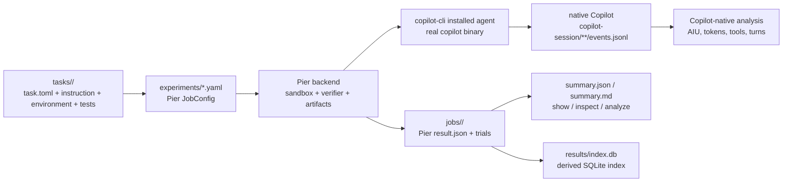

# copilot-experiments

A **Pier-first experiment harness** for running coding agents in sandboxed tasks and analyzing
their results, with special support for capturing **GitHub Copilot CLI** sessions exactly as the
real CLI produces them.

> This repository is the **tool**. Use `copilot-experiments init` to scaffold a separate
> experiment repository containing Pier job YAML and Harbor/Pier task directories.

## How it works



- **Tasks** are Harbor/Pier task directories: `task.toml`, `instruction.md`, `environment/`,
  `tests/test.sh`, and optional solutions/artifacts.
- **Experiments** are Pier `JobConfig` YAML files under `experiments/`.
- **Pier** owns sandbox execution, agent installation, trial orchestration, verifier execution,
  and artifact transfer.
- **Copilot CLI remains the system under test.** The local Pier agent shells out to the real
  `copilot` binary; it does not use a Copilot SDK or custom tool loop.
- **Native Copilot logs remain primary** for Copilot-specific metrics. ATIF trajectory output is
  also captured for cross-agent compatibility and non-Copilot agents.

## Quickstart

```bash
uv sync

# scaffold a standalone experiment repo
uv run copilot-experiments init my-experiments
cd my-experiments
uv sync

# validate Pier job configs without starting a sandbox
uv run copilot-experiments run --dry-run

# run for real through Pier
uv run copilot-experiments run
uv run copilot-experiments show --last
uv run copilot-experiments analyze --last
```

Real runs require Copilot auth (`COPILOT_GITHUB_TOKEN`, `GH_TOKEN`, `GITHUB_TOKEN`, or `gh auth
login`) and a Pier-supported execution backend such as Docker.

## Bundled examples

```bash
uv run copilot-experiments run --root examples/tracer_bullet --dry-run
uv run copilot-experiments run --root examples/tracer_bullet
uv run copilot-experiments analyze --root examples/tracer_bullet --last
```

- [`examples/tracer_bullet`](examples/tracer_bullet) - one small task, cheap Copilot model.
- [`examples/task_suite`](examples/task_suite) - two tasks of different difficulty.
- [`examples/swebench`](examples/swebench) - local SWE-bench-shaped Pier tasks.

## CLI

| Command | Description |
| --- | --- |
| `init <dir>` | Scaffold a standalone Pier experiment repository. |
| `run [name]` | Discover Pier job configs in `experiments/` and run them. Falls back to legacy Python experiments when no Pier configs exist. |
| `run --dry-run` | Validate Pier job configs, or run the legacy ephemeral mock dry-run for legacy experiments. |
| `list` | List Pier job configs, legacy experiments, and stored jobs/runs. |
| `show <job>` / `show --last` | Print a summary for a Pier job or legacy run. |
| `analyze <job>` / `analyze --last` / `analyze --file <events.jsonl>` | Render a rich overview of a native Copilot session log. |
| `inspect <job>` | Drill into stored trials and status. |
| `reindex` | Rebuild the derived SQLite index from `jobs/` and legacy `results/`. |

## Documentation

- [`docs/architecture.md`](docs/architecture.md) - Pier-first architecture.
- [`docs/authoring-experiments.md`](docs/authoring-experiments.md) - task and job authoring.
- [`docs/results-format.md`](docs/results-format.md) - `jobs/` layout and derived index.
- [`docs/analysis.md`](docs/analysis.md) - native Copilot session analysis.
- [`docs/byok-and-local-models.md`](docs/byok-and-local-models.md) - provider env for Copilot CLI.
- [`docs/swebench.md`](docs/swebench.md) - SWE-bench direction after the Pier refactor.
- [`docs/adr/`](docs/adr) - architecture decision records.

## Development

```bash
uv sync
uv run ruff check --fix .
uv run ruff format .
uv run ruff check .
uv run pytest -q
```

Install the local hooks once to make Ruff formatting/lint fixes automatic on commit and tests run
on push:

```bash
uv run pre-commit install --install-hooks
uv run pre-commit install --hook-type pre-push
```

See [`AGENTS.md`](AGENTS.md) for contributor guidance.
