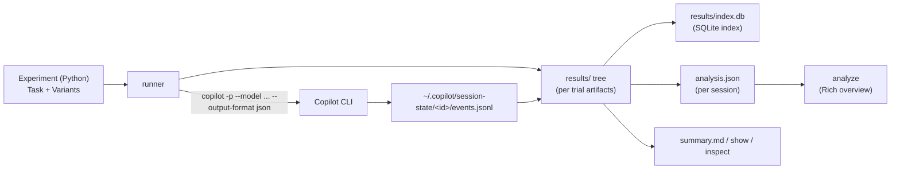

# copilot-experiments

A **library + CLI** for building research experiments that exercise **GitHub Copilot**
(primarily the **Copilot CLI**) and collect results.

Define experiments in Python, run them across a matrix of parameters (different Copilot
models, reasoning efforts, agents, or **BYOK** local models such as Ollama / vLLM), then
collect and analyze the resulting Copilot CLI **session logs** to measure effectiveness,
cost-effectiveness, and failure modes.

> This repository is the **tool**. You author and run actual experiments in a separate
> repository scaffolded with `copilot-experiments init`.

## How it works



- An **experiment** is a Python object: a `Task` (prompt + workspace fixture + optional
  `verify` command) and a list of `Variant`s (the parameter matrix).
- The runner provisions an isolated workspace per **trial**, invokes the Copilot CLI
  non-interactively, copies the session `events.jsonl`, captures the workspace diff, runs
  the verification command, and parses metrics.
- Results are written to a clear **filesystem layout** under `results/` and indexed into a
  **SQLite** database for cross-run queries.

## Quickstart

```bash
# install the tool (this repo)
uv sync

# scaffold a new, standalone experiment repository
uv run copilot-experiments init my-experiments
cd my-experiments
uv sync

# validate the whole pipeline without spending credits (mock Copilot; persists nothing)
uv run copilot-experiments run --dry-run

# run for real (preflights GitHub auth: COPILOT_GITHUB_TOKEN/GH_TOKEN/GITHUB_TOKEN or `gh auth login`)
uv run copilot-experiments run
uv run copilot-experiments show --last
```

### Try the bundled tracer bullet (no scaffolding)

A small, **multi-turn** example ships in this repo. From the repo root:

```bash
uv sync

# validate the pipeline end-to-end (mock Copilot, no credits, nothing saved)
uv run copilot-experiments run     --root examples/tracer_bullet --dry-run

# run it for real, then render the captured session log
uv run copilot-experiments run     --root examples/tracer_bullet
uv run copilot-experiments analyze --root examples/tracer_bullet --last
```

`analyze` reads the captured Copilot **session log** and renders a Rich overview — session
header, totals, a per-tool histogram, and a per-turn timeline. See
[`examples/tracer_bullet/`](examples/tracer_bullet) and [`docs/analysis.md`](docs/analysis.md).

## CLI

| Command | Description |
| --- | --- |
| `init <dir>` | Scaffold a new standalone experiment repository. |
| `run [name]` | Discover and run experiment(s) in `experiments/`; writes `results/` + index. Add `--dry-run` to validate the whole pipeline in a temp dir and persist nothing. |
| `list` | List experiments and past runs. |
| `show <run-id>` / `show --last` | Print a run summary and per-variant comparison. |
| `analyze <run-id>` / `analyze --last` / `analyze --file <events.jsonl>` | Render a rich overview of a session log (timeline, tools, tokens). |
| `inspect <run-id>` | Drill into a trial's session events and metrics. |
| `reindex` | Rebuild `results/index.db` from the filesystem. |

## Documentation

- [`docs/architecture.md`](docs/architecture.md) — how the pieces fit together.
- [`docs/authoring-experiments.md`](docs/authoring-experiments.md) — write experiments in Python.
- [`docs/analysis.md`](docs/analysis.md) — the `analyze` command, the `SessionAnalysis` model, and the web explorer (TBD).
- [`docs/results-format.md`](docs/results-format.md) — the on-disk layout and SQLite schema.
- [`docs/byok-and-local-models.md`](docs/byok-and-local-models.md) — run experiments against BYOK / local models.
- [`docs/adr/`](docs/adr) — architecture decision records.

## Development

This project is managed with [uv](https://docs.astral.sh/uv/) and uses
[APM](https://github.com/microsoft/apm) for agent context management.

```bash
uv sync
uv run ruff check
uv run pytest
```

See [`AGENTS.md`](AGENTS.md) for agent-oriented contributor guidance.
