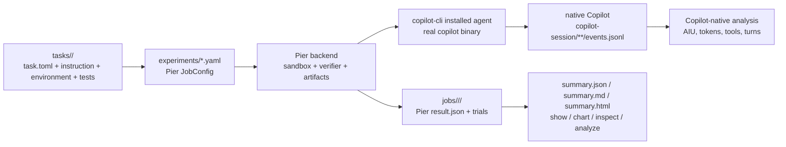

# copilot-experiments

A **Pier-first experiment harness** for running coding agents in sandboxed tasks and analyzing
their results, with special support for capturing **GitHub Copilot CLI** sessions exactly as the
real CLI produces them.

> This repository is the **tool**. Use `copilot-experiments init` to scaffold a separate
> experiment repository containing Pier job YAML and Harbor/Pier task directories.

## How it works



- **Tasks** are Harbor/Pier task directories: `task.toml`, `instruction.md`, `environment/`,
  `tests/test.sh`, and optional solutions/artifacts.
- **Experiments** are Pier `JobConfig` YAML files under `experiments/`.
- **Pier** owns sandbox execution, agent installation, trial orchestration, verifier execution,
  and artifact transfer.
- **Copilot CLI remains the system under test.** The local Pier agent shells out to the real
  `copilot` binary; it does not use a Copilot SDK or custom tool loop.
- **Native Copilot logs remain primary** for Copilot-specific metrics. ATIF trajectory output is
  also captured for cross-agent compatibility and non-Copilot agents.

## Quickstart

```bash
uv sync

# scaffold a standalone experiment repo
uv run copilot-experiments init my-experiments
cd my-experiments
uv sync

# validate Pier job configs, paths, auth, and backend setup
uv run copilot-experiments validate

# run for real through Pier
uv run copilot-experiments run
uv run copilot-experiments list
uv run copilot-experiments show --last
uv run copilot-experiments chart --last --open
uv run copilot-experiments analyze --last
```

To use a local checkout of this tool from any other directory, run the console script through
`uvx --from` instead of syncing this repository first:

```bash
# Use the path to your local github-copilot-lab checkout.
export COPILOT_EXPERIMENTS_REPO=/path/to/github-copilot-lab

uvx --from "$COPILOT_EXPERIMENTS_REPO" copilot-experiments init my-experiments
cd my-experiments
uvx --from "$COPILOT_EXPERIMENTS_REPO" copilot-experiments validate
uvx --from "$COPILOT_EXPERIMENTS_REPO" copilot-experiments list
uvx --from "$COPILOT_EXPERIMENTS_REPO" copilot-experiments show --last
```

In PowerShell, set
`$env:COPILOT_EXPERIMENTS_REPO = "C:\path\to\github-copilot-lab"` and use
`uvx --from $env:COPILOT_EXPERIMENTS_REPO copilot-experiments ...`. This installs from the
current local checkout into uv's cache. If you are iterating on the tool and need to force uv to
rebuild from the working tree, add `--no-cache` before `--from`.

Real runs require Copilot auth (`COPILOT_GITHUB_TOKEN`, `GH_TOKEN`, `GITHUB_TOKEN`, or `gh auth
login`) and a Pier-supported execution backend such as Docker. `run` preflights the selected
backend before creating a job; for Docker this checks the CLI, Compose plugin, and daemon
connection so missing WSL integration fails before an empty Pier job is recorded.

Each `run` is a new measurement. The configured Pier `job_name` remains the stable experiment
identity, while each execution gets a timestamped run directory under
`jobs/<job_name>/<run-id>/`. Pass `--resume` only when you intentionally want to reuse the latest
run directory for that job and let Pier skip already-completed trials.

Use `copilot-experiments list` after a run to copy the selector for a concrete execution. Pier
selectors use `job-name/run-id`; passing just `job-name` selects that job's latest run, while
`--last` selects the most recent stored run overall.

## Bundled examples

```bash
uv run copilot-experiments validate --root examples/tracer_bullet
uv run copilot-experiments run --root examples/tracer_bullet
uv run copilot-experiments analyze --root examples/tracer_bullet --last
```

- [`examples/tracer_bullet`](examples/tracer_bullet) - one small task, cheap Copilot model.
- [`examples/task_suite`](examples/task_suite) - two tasks of different difficulty.

## CLI

| Command | Description |
| --- | --- |
| `init <dir>` | Scaffold a standalone Pier experiment repository. |
| `deepswe-import <path>` | Generate a Pier job config for a cloned DeepSWE checkout, `tasks/` corpus, or single task. |
| `validate [name]` | Validate Pier job configs, referenced task/dataset paths, auth, and backend setup without creating a run. |
| `run [name]` | Discover Pier job configs in `experiments/` and run them. Each run writes to a fresh `jobs/<job>/<run-id>/` directory. |
| `run --resume` | Resume an existing Pier job directory and skip already-completed matching trials. |
| `list` | List Pier job configs and copyable run selectors. |
| `show <selector>` / `show --last` | Print a summary for a Pier run (`job` or `job/run`). |
| `chart <selector>` / `chart --last` | Write an interactive `summary.html` dashboard for a Pier run (`--open`, `--out`, `--cdn`). |
| `inspect <selector>` | Drill into stored trials by `--agent`, `--task`, and `--trial`. |
| `analyze <selector>` / `analyze --last` / `analyze --file <events.jsonl>` | Render a rich overview of a selected Copilot session log. |

## Documentation

- [`docs/architecture.md`](docs/architecture.md) - Pier-first architecture.
- [`docs/authoring-experiments.md`](docs/authoring-experiments.md) - task and job authoring.
- [`docs/deepswe.md`](docs/deepswe.md) - importing and running DeepSWE tasks through Pier.
- [`docs/collecting-run-data.md`](docs/collecting-run-data.md) - everything to collect around a Copilot CLI run, including native `events.jsonl`, Pier artifacts, ATIF, and OTel.
- [`docs/results-format.md`](docs/results-format.md) - Pier `jobs/` layout and derived summaries.
- [`docs/visualizing-results.md`](docs/visualizing-results.md) - interactive `summary.html` dashboards.
- [`docs/analysis.md`](docs/analysis.md) - native Copilot session analysis.
- [`docs/diagnosing-agent-shutdowns.md`](docs/diagnosing-agent-shutdowns.md) - why a run "stops", the 600s timeout, and hang-vs-proxy triage.
- [`docs/byok-and-local-models.md`](docs/byok-and-local-models.md) - provider env for Copilot CLI.
- [`docs/adr/`](docs/adr) - architecture decision records.

## Development

```bash
uv sync
uv run ruff check --fix .
uv run ruff format .
uv run ruff check .
uv run pytest -q
uv run pytest --cov=copilot_experiments --cov-report=term-missing:skip-covered
```

Install the local hooks once to make Ruff formatting/lint fixes automatic on commit and tests run
on push:

```bash
uv run pre-commit install --install-hooks
uv run pre-commit install --hook-type pre-push
```

The pre-push hook runs plain pytest for speed. Run the coverage command explicitly when you need
branch coverage and missing-line details; CI also runs it for every push and pull request.

See [`AGENTS.md`](AGENTS.md) for contributor guidance.
