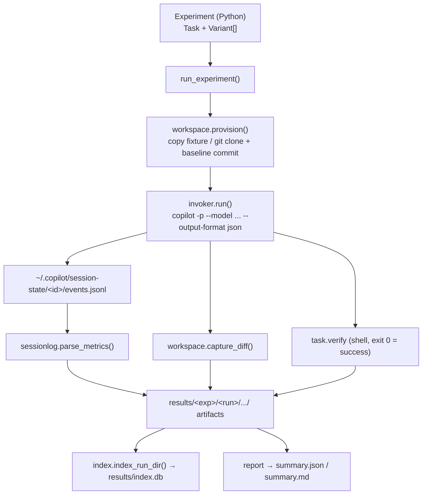

# Architecture

`copilot-experiments` is a small, layered Python package. The filesystem is always the
source of truth; the SQLite index is a derived cache that can be rebuilt at any time.

## Pipeline



## Object model

| Concept | Type | Meaning |
| --- | --- | --- |
| **Experiment** | `Experiment` | A named `Task` plus the matrix of `Variant`s to run it under. |
| **Task** | `Task` | The prompt + how to provision (`fixture` or `repo`/`ref`, `setup`) and `verify` the workspace. |
| **Variant** | `Variant` | One cell of the matrix: `model`, `reasoning_effort`, `agent`, `mode`, tool allow/deny, optional BYOK `provider`, extra `env`, and `trials` (repeat count). |
| **ProviderConfig** | `ProviderConfig` | BYOK settings rendered to `COPILOT_PROVIDER_*` env vars. |
| **Experiment run** | `ExperimentRun` | One execution of an experiment → `results/<exp>/<run-id>/`. |
| **VariantResult / TrialResult** | result models | Per-variant aggregation and per-trial outcome (+ parsed `Metrics`). |

## Modules

| Module | Responsibility |
| --- | --- |
| `models.py` | All pydantic schemas (definitions + results). Secret redaction lives here. |
| `workspace.py` | Provision an isolated workspace per trial; commit a git baseline; capture a diff. |
| `invoker.py` | Translate a variant into a `copilot` command and run it. `CopilotInvoker` (real) and `MockInvoker` (dry-run/tests). |
| `sessionlog.py` | Find and parse `events.jsonl` into `Metrics`. |
| `runner.py` | Orchestrate variants × trials and write every artifact. |
| `storage.py` | The `results/` `Layout` and run discovery (`find_run`, `latest_run`). |
| `index.py` | The SQLite schema, insert/reindex, and queries. |
| `report.py` | Aggregate a run into `summary.json` / `summary.md`. |
| `scaffold.py` | `init`: render the experiment-repo template. |
| `cli.py` | The Typer CLI. |

## Two-repo model

- **This repo** is the *tool* (library + CLI). It is installable and developed with `uv`, and
  has its own APM context (`apm.yml`, `.apm/`, `AGENTS.md`) for developing the library.
- **`copilot-experiments init <dir>`** scaffolds a *separate* standalone experiment repository
  (its own `uv` project that depends on this package) where people author and run experiments.
- **`sandbox/`** is a local scratch area for exercising the lib/CLI; its `results/` are gitignored.

## How Copilot CLI is invoked

The Copilot CLI is run non-interactively, one process per trial:

```
copilot -p "<prompt>" --output-format json --session-id <uuid> \
        --log-dir <dir> -C <workspace> [--allow-all-tools] \
        [--model M] [--effort E] [--agent A] [--mode MODE] \
        [--allow-tool T ...] [--deny-tool T ...]
```

- `--session-id` is generated per trial so the rich session stream at
  `~/.copilot/session-state/<id>/events.jsonl` can be copied alongside the trial's artifacts.
- **BYOK** providers are injected purely through `COPILOT_PROVIDER_*` environment variables;
  a variant is therefore just *flags + env*.

## Design invariants

1. **Filesystem is canonical.** `reindex` rebuilds `results/index.db` by scanning `results/`.
2. **Secrets are never stored.** `Variant.stored()` / `ProviderConfig.redacted()` mask keys.
3. **Offline-testable.** `MockInvoker` simulates a run (synthetic `events.jsonl`), so the test
   suite and dry-runs need no Copilot credits or network.
4. **Isolated dry-runs.** Dry-run session state is written under the run dir, not the global
   `~/.copilot/session-state`.
