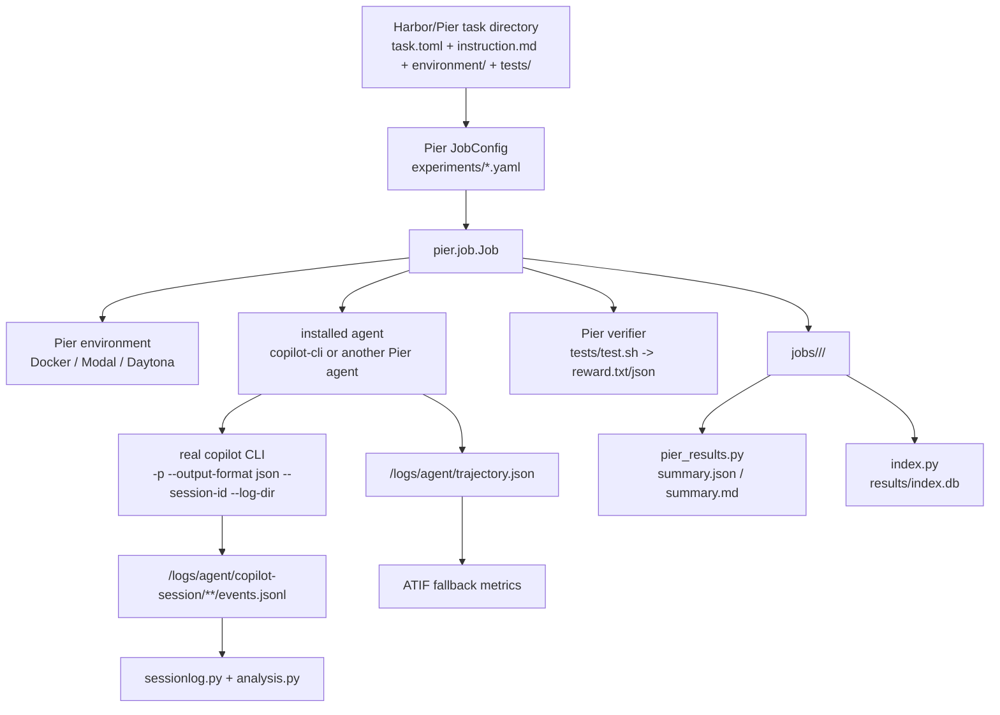

# Architecture

`copilot-experiments` is now a thin integration layer around Pier. Pier provides the execution
substrate; this package contributes a GitHub Copilot CLI installed agent, Copilot-native session
analysis, a small CLI, templates, and derived reporting/indexing.

## Pipeline



## Main modules

| Module | Responsibility |
| --- | --- |
| `pier_agents/copilot_cli.py` | Pier `BaseInstalledAgent` that installs and runs the real Copilot CLI, captures native session logs, and emits ATIF. |
| `pier_backend.py` | Discovers and normalizes Pier `JobConfig` YAML/JSON, maps `name: copilot-cli` to the local import path, injects Copilot auth, and calls Pier's Python API. |
| `pier_results.py` | Reads Pier job directories and adapts them into the existing summary/show/analyze shape. |
| `sessionlog.py` | Parses native Copilot `events.jsonl` into flat metrics, including AIU/token economics. |
| `analysis.py` / `render.py` | Builds and renders a richer session analysis view from native Copilot events. |
| `storage.py` | Locates canonical Pier `jobs/` plus legacy `results/`. |
| `index.py` | Rebuildable SQLite index over Pier jobs and legacy runs. |
| `scaffold.py` | Renders a Pier-first experiment repository template. |
| `cli.py` | Typer CLI for init/run/list/show/inspect/analyze/reindex. |

Legacy `Experiment`, `Task`, `Variant`, `runner.py`, `workspace.py`, and `invoker.py` remain as a
compatibility path when an experiment repository has no Pier job configs. New work should use Pier
tasks and jobs.

## Copilot CLI installed agent

The local agent is available as:

```yaml
agents:
  - name: copilot-cli
    model_name: gpt-5-mini
    kwargs:
      reasoning_effort: low
```

During normalization, `name: copilot-cli` becomes
`copilot_experiments.pier_agents.copilot_cli:CopilotCli`. The agent:

- installs Copilot CLI through the official installer;
- allowlists GitHub/Copilot domains for Pier network policy;
- runs `copilot -p <instruction> --output-format json --session-id <uuid> --log-dir
  /logs/agent/copilot-session`;
- supports model, effort, mode, context tier, MCP config, skills, and extra CLI args through Pier
  agent kwargs;
- writes raw CLI JSONL/text, ATIF `trajectory.json`, and native Copilot session logs.

## Design invariants

1. **Pier jobs are canonical.** `jobs/<job>/` is the primary source of truth for new runs.
2. **SQLite is derived.** `results/index.db` can be rebuilt from `jobs/` and legacy `results/`.
3. **Copilot logs are primary for Copilot metrics.** ATIF is a fallback and cross-agent view.
4. **Copilot CLI is not reimplemented.** The installed agent shells out to the real CLI.
5. **Tests stay offline.** Unit tests use config and job fixtures, not Docker or real Copilot.
6. **Secrets stay out of persisted config.** Auth is injected at run time via environment.
