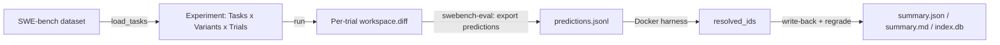

# SWE-bench token-consumption experiments

This harness can reproduce the experimental protocol of Bai et al., *"How Do Coding
Agents Spend Your Money?"* (COLM 2026) — but with **GitHub Copilot CLI as the agent**
instead of OpenHands. You run a configurable subset of **SWE-bench** instances, repeat
each N times (their paper used **4 runs**; here that is the `trials` axis), grade
resolution with the **official `swebench` Docker harness**, and analyse the results with
the harness's existing token-economics, cross-run variance, and difficulty-vs-cost lenses.

See [ADR-0014](adr/0014-swebench-task-source-and-docker-grading.md) for the design and
[`examples/swebench/`](../examples/swebench) for a runnable, fully offline demo.

## The protocol we replicate

| Aspect | Paper (OpenHands) | This harness (Copilot CLI) |
| --- | --- | --- |
| Benchmark | SWE-bench (~500 instances) | SWE-bench Verified / Lite, config-driven subset |
| Repeats | 4 runs per instance | `trials` (the variant's `trials=`) |
| Prompt | no-hint (issue text only) | bare `problem_statement` (hidden tests never shown) |
| Token signal | OpenHands `llm_completions/*.json` | Copilot session log → `Metrics` / `TokenEconomics` |
| Accuracy | SWE-bench `resolved_ids` | SWE-bench `resolved_ids` (official Docker harness) |
| Analyses | token decomposition, variance, cost-vs-accuracy, difficulty, 5-phase | same, already in `report.py` / `analyze` |

## How it fits together

- **Loading.** `copilot_experiments.swebench.load_tasks` turns SWE-bench instances into
  `Task`s. Each instance becomes one task whose prompt is the bare `problem_statement`,
  whose `repo`/`ref` point at the instance's repo at `base_commit`, and which carries a
  structured `SweBenchInstance` block (`instance_id`, `difficulty`, `FAIL_TO_PASS`,
  `PASS_TO_PASS`, …) persisted to `task.json`.
- **Running.** A normal `copilot-experiments run`. Each trial provisions a clean clone,
  runs Copilot host-native (Windows or Linux), and captures `workspace.diff` — the
  candidate `model_patch`.
- **Grading is a separate stage.** `copilot-experiments swebench-eval` exports one
  `predictions.jsonl` per `(variant, trial)`, runs the official harness in Docker, reads
  back `resolved_ids`, writes the resolved/unresolved verdict into each trial, and
  re-aggregates `summary.{json,md}` + the SQLite index. The per-trial `verify` command is
  **not** used for SWE-bench grading.



## Quick start (offline demo — no network, no Docker)

```bash
uv run copilot-experiments run  --root examples/swebench --dry-run
uv run copilot-experiments show --root examples/swebench --last
```

The demo swaps real repos for two tiny local fixtures of differing `difficulty`, so the
**Difficulty vs cost** table renders and the predictions-export path behaves just like it
does for real instances.

## The real protocol

### 1. Materialize an experiment

```bash
# Smoke set: first 3 Verified instances, one model, 2 trials each.
uv run copilot-experiments swebench-init my-run --limit 3 --model claude-sonnet-4.5 --trials 2

# Scale toward the paper: a model matrix over Verified/500 x 4 runs.
uv run copilot-experiments swebench-init my-run \
    --dataset princeton-nlp/SWE-bench_Verified \
    --model claude-sonnet-4.5 --model gpt-5 --model gemini-3-pro \
    --trials 4
```

`swebench-init` downloads the subset (optional `datasets` package), caches it to
`my-run/swebench/instances.json` for reproducibility, and generates
`my-run/experiments/swebench_experiment.py`. Pass `--instances-file path.json` (a JSON
array or JSONL of instance dicts) to skip the download and stay offline. Use
`--instance-id` (repeatable) to pick specific instances.

### 2. Run Copilot on the instances

```bash
uv run copilot-experiments run --root my-run
```

### 3. Grade resolution in Docker

```bash
uv run copilot-experiments swebench-eval --root my-run --last
```

After grading, `show --last` reflects ground truth: `resolved@k`, mean-success,
AIU-per-solve, and the difficulty-vs-cost breakdown.

## Optional dependencies

Both grading inputs are **optional** — the core install, the offline example, and the
test suite never need them:

```bash
uv pip install datasets   # for swebench-init to download from Hugging Face
uv pip install swebench    # + Docker, for swebench-eval grading
```

The grader runs each instance in its own Linux container, so you need **Docker** with
Linux containers — start Docker Desktop or point `DOCKER_HOST` at a remote engine. When
either piece is missing, `swebench-eval` fails with a clear, actionable message rather than
a stack trace.

## Scaling caveats

v1 provisions a full clone per trial and runs sequentially. That is fine for a smoke set
or a few dozen instances, but pointing it at Verified/500 × 4 is expensive and
crash-fragile (no resumable/parallel execution, no cached bare mirrors, no pre-built
environment images yet). Those are deferred follow-ups — see ADR-0012 and ADR-0014.
